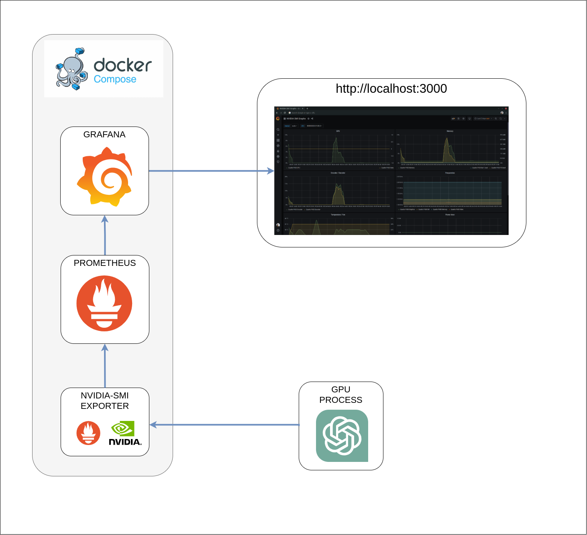

#### Single host GPU monitoring stack, driven by docker-compose.


#### components 
* nvivia-smi
* grafana
* prometheus
* prometheus-nvivia-smi metrics expotrer


#### prequirements
* CUDA 11.X/12.X
* [NVIDIA Container Toolkit](https://docs.nvidia.com/datacenter/cloud-native/container-toolkit/latest/install-guide.html)


#### manage containers

```bash
# start
$ docker compose -f docker-compose.dev.yml up  -d --build  --force-recreate --remove-orphans

# logs
$ docker compose -f docker-compose.dev.yml logs -f

# down
$ docker compose -f docker-compose.dev.yml down

```

***

##### referenses
 
* https://github.com/e7d/docker-prometheus-nvidiasmi

* https://docs.nvidia.com/datacenter/cloud-native/container-toolkit/latest/install-guide.html

* https://grafana.com/grafana/dashboards/12357-nvidia-smi-graphs/

